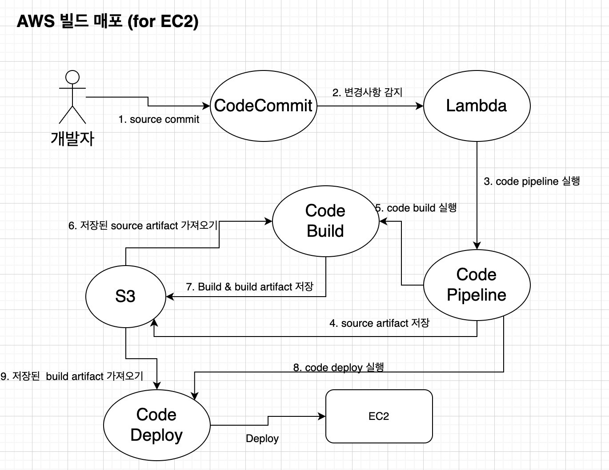

 <br>

Spring boot로 어플리케이션을 개발한 프로그램을 EC2에 배포하는 절차를 설명한다.

### 파이프라인 생성

#### 파이프라인 설정

- 파이프라인을 생성한다.
  dev : lrc-websocket-app-dev-pipeline  
  prod : lrc-websocket-app-prod-pipeline
- 서비스는 새로운 역할을 생성하도록 체크.
  dev : lrc-websocket-app-pipeline-servicerole-dev  
  prod : lrc-websocket-app-pipeline-servicerole-prod
- 고급설정
  소스와 빌드된 코드가 저장되는 아티팩트 저장 위치를 설정한다. 자동생성이 아닌 경우 버킷을 생성하고 연결해야 한다.

#### 소스 스테이지 추가

- 소스 공급자 : codecommit
- 연결
- 리포지토리 이름 : lrc-websocket-app
- branch name : dev (or prod)
- 변경감지 옵션 : 소스 코드 변경 시 파이프라인 시작 (checked)
- 출력 아티펙트 형식 : CodePipeline 기본값

#### 빌드 스테이지 추가

소스코드를 가져온 뒤에는 가져온 소스로 빌드를 해야 한다. 빌드 공급자를 AWS CodeBuild로 선택하고 리전은 각 상황에 맞게 선택한다. 프로젝트 생성 버튼을 클릭해 빌드 프로젝ㄴㅌ를 생성한다.
[ 빌드 프로젝트 생성 - codebuild]

- 프로젝트 이름
  dev : lrc-websocket-app-dev-build
  prod : lrc-websocket-app-prod-build
- 환경
  환경 이미지 : 관리형 이미지  
  운영체제 : Amazon Linux  
  런타임 : Standard  
  이미지 : aws/codebuild/standard:5.0  
  이미지 버전 : 이 런타임 버전에는 향상 최신 이미지 사용  
  환경 유형 : Linux  
  서비스 역할 : 새 서비스 역할
  - 역할 이름 : codebuild-lrc-websocket-app-dev-servicerole
    추가 구성

#### BuildSpec, 배치구성, 로그

- Buildspec
  빌드 사양 : buildspec 파일 사용  
  Buildspec 이름 : buildspec.yml
- 로그
  CloudWatch : checked

#### 빌드 스테이지 추가 확인

### 배포 스테이지 건너뛰기

파이프라인 설정을 통해서 원격 레포지토리에서 소스를 가져오고 (소스 스테이지), 가져온 소스를 빌드하는 설정까지 완료했다. 빌드된 어플리케이션을 EC2 서버로 배포해야 하지만  
배포 스테이지의 경우 파이프라인 상에서 바로 배포 어플리케이션을 생성할 수 있도록 제공하지 않는다. 따라서 해당 부분은 [배포 스테이지 건너뛰기]를 통해 우선 스킵하고 추후에 파이프라인에 다시 넣는다.

### 완료 후 배포 스테이지 추가하기

파이프라인이 생성 완료되면 스킵하고 건너띈 배포 단계를 추가하기 위해 배포 어플리케이션 생성이 필요하다. 이를 위해서 우선 CodeDeploy 용 역할을 생성하는 것이 필요하다.  
이 역할을 통해서 AWS CodeDeploy 서비스는 배포 역할을 가지고 EC2 에 접근하여 배포를 수행할 수 있다.

#### IAM에 CodeDeploy용 역할 생성

IAM에서 역할 만들기를 선택하고 AWS 서비스를 선택한 뒤 CodeDeploy를 선택한다. 선택 후 사용 사례 선택에서 CodeDeploy를 선택하고 [다음: 권한]으로 넘어간다.  
권한 정책이 AWSCodeDeployRole이 연결된 것을 확인할 수 있다.

- 역할 이름 : lrc-websocket-app-codedeploy-role

### CodeDeploy 생성하기

위에서 역할을 만든 것을 활용해서 CodeDeploy 어플리케이션을 생성한다. CodeDeploy 어플리케이션 생성을 클릭한다.

- 어플리케이션 이름 : lrc-websocket-app-dev-codedeploy
- Computing Flatform : EC2/OnPrimise

#### 배포그룹 생성

- 배포 그룹 이름 : lrc-websocket-app-dev-deploy-group
- 서비스 역할 : 위에서 생성한 lrc-websocket-app-codedeploy-role 선택
- 배포 유형 : 현재 위치 (블루/그린 고려)
- 환경 구성
  Amazon EC2 인스턴스 : checked
- 배포 설정
  배포 구성 : CodeDeployDefault.AllAtOnce

### 파이프라인 배포 스테이지 추가하기

- 기존 생성된 파이프라인 페이지에서 편집을 클릭
- 스테이지를 추가한다. : Deploy
- 작업 그룹 추가를 클릭
  작업 이름 : lrc-websocket-app-dev-codedeploy  
  작업 공급자 : AWS CodeDeploy  
  리전 : 서울  
  입력 아티펙트 : BuildArtfact  
  어플리케이션 이름 : lrc-websocket-app-dev-codedeploy  
  배포그룹 : lrc-websocket-app-dev-deploy-group

### 어플리케이션 적용 사항

spring boot 프로젝트 루트에 아래 buildspec.yml이 생성되어야 한다.

- buildspec.yml

```yml
version: 0.2

phases:
  build:
    commands:
      - echo Entered the build phase...
      - echo Build Starting on `date`
      - cd lrc-websocket-app
      - chmod +x ./gradlew
      - ./gradlew clean build
    post_build:
      commands:
        - echo Entered the post_build phase...
        - echo Build completed on `date`
        - echo $(basename ./build/libs/*.jar)
        - pwd
cache:
  paths:
    - "/root/.gradle/caches/**/*"
```

### 배포 스테이지 구성

- EC2 서버를 위한 역할 생성
  아래 4가지 정책 추가한다.

  - AmazonS3FullAccess
  - AWSCodeDeployFullAccess
  - AWSCodeDeployRole
  - CloudWatchLogsFullAccess

  Role name : websocket-deploy-ec2-role

- 만들어진 역할을 WebSocket 어플리케이션이 배포될 EC2 서버에 추가한다.

  - EC2 > 인스턴스 클릭 > 작업 > 세부정보보기
  - IAM 역할 연결하기 : 작업 > 보안 > IAM 역할로 수정

- IAM > EC2에서 CodeDeploy Agent 용 사용자 추가하기
  CodeDeploy에서 배포가 시작되면 EC2 서버에서는 그 이벤트를 수신할 수 있어야 한다. 그것을 위해서 이 이벤트를 수신하기 위한 CodeDeply Agent용 사용자를 추가해주어야 한다.
  - IAM에서 그룹을 만들고 그 그룹에 정책을 연결한 뒤 해당 그룹에 들어갈 사용자를 추가해주는 방식으로 관리가 되므로 먼저 그룹을 만들어준다.
  - 그룹 생성을 완료하면 인라인 정책으로 아래와 같은 정책을 추가한다.

```json
{
  "Version": "2012-10-17",
  "Statement": [
    {
      "Effect": "Allow",
      "Action": [
        "autoscaling:*",
        "codedeploy:*",
        "ec2:*",
        "lambda:*",
        "elasticloadbalancing:*",
        "s3:*",
        "cloudwatch:*",
        "logs:*",
        "sns:*"
      ],
      "Resource": "*"
    }
  ]
}
```

위의 정책은 EC2에 ssh로 접속하기 위한 부분이다. 이미 접속 가능한 유저가 있다면 필요 없다. (프로그래밍 방식의 접근 권장)

- EC2 > AWS Cli 설치하기
  AWS CodeDeploy로부터 이벤트를 수신받기 위해서는 EC2 서버 내에 CodeDeploy Agent를 설치해야 한다.  
  o AWS CLI 설치

```shell
$ sudo apt install awscli
$ aws --version
```

- EC2 > AWS CodeDeploy Agent 설치
  aws cli를 설치한 뒤, CodeDeploy agent를 설치한다.  
  사용자 홈으로 이동한 뒤 접속 User의 aws configure를 설정한다.
  - agent 설치파일 다운받기
    wget https://aws-codedeploy-ap-northeast-2.s3.amazonaws.com/latest/install
  - 실행파일에 권한 추가하기
    chmod +x ./install
  - 설치
    sudo ./install auto
  - agent 실행 확인
    sudo service codedeploy-agent status
  - EC2 인스턴스가 부팅되면 자동으로 AWS CodeDeploy Agent가 실행될 수 있도록 스크립트 파일 생성  
    sudo vim /etc/init.d/codedeploy-startup.sh

```shell
#!/bin/bash
echo 'Starting codedeploy-agent'
sudo service codedeploy-agent start
```

- 파일 내용 확인
  cat /etc/init.d/codedeploy-startup.sh
- 스크립트 저장 후 실행권한 추가
  sudo chmod +x /etc/init.d/codedeploy-startup.sh

### 프로젝트에서 사용하는 buildspec.yml 수정

```yml
version: 0.2

phases:
  build:
    commands:
      - echo Entered the build phase...
      - echo Build Starting on `date`
      - cd lrc-websocket-app
      - chmod +x ./gradlew
      - ./gradlew clean build -x test
    post_build:
      commands:
        - echo Entered the post_build phase...
        - echo Build completed on `date`
        - echo $(basename ./build/libs/*.jar)
        - pwd
##############################################
# 코드를 빌드한 이후 빌드 결과물인 아티펙트에 포함시킨다.
artifacts:
  files:
    - appspec.yml
    - build/libs/*.jar
    - scripts/**
  discard-paths: yes
  base-directory: lrc-websocket-app
##############################################
cache:
  paths:
    - "/root/.gradle/caches/**/*"
```

- artifacts 부분은 빌드 결과물에 포함할 파일들을 지정하는 것이다.
  - appspec.yml : AWS CodeDeploy가 어떤 파일들을 어느 위치에 배포할 지, 그리고 그 후에는 어떤 스크립트를 실행시킬 건지 모두 관리하는 역할을 한다.
  - build/libs/\*.jar : 빌드 결과로 생성된 jar 파일
  - scripts/\*\* : 배포 이후 실행시킬 스크립트를 저장할 디렉토리이다. 없다면 루트 위치에 하나 만들어준다.
  - discard-paths: 절대경로를 버리고 루드/파일명으로 설정한다.
  - base-directory: 기본 루트 디렉토리를 설정해준다. 없으면 그냥 해당 설정 자체를 없앤다.

### 프로젝트 내부에서 appspec.yml 생성

AWS CodeDeploy가 어떤 파일들을 어느 위치에 배포하는지, 배포 후에는 어떤 스크립트를 실행하는지 관리하는 정의파일이다. buildspec.yml 파일의 위치에서 생성한다.

```yml
version: 0.0
os: linux
files:
  - source: /
    destination: /home/lrc/lrc-websocket-app/build/

permissions:
  - object: /
    pattern: "**"
    mode: 755
    owner: lrc
    group: lrc

hooks:
  ApplicationStart:
    - location: deploy.sh
      timeout: 60
      runas: lrc
  ValidateService:
    - location: healthCheck.sh
      timeout: 60
      runas: lrc
```

- files
  소스 스테이지에서 받은 전체 파일들을 EC2 서버 내부의 /home/lrc/lrc-websocket-app/build/로 옮겨준다는 의미  
  EC2 내우에 해당 위치에 미리 build 디렉토리를 생성해야 한다.
- permissions
  - files 섹션의 파일 및 디렉토리/폴더가 인스턴스에 복사된 후 특수 권한(있는 경우)이 어떻게 적용되어야 하는지를 지정하는 것이다.
  - lrc 사용자 및 그룹으로 로그인하고 전체 파일에 대하여 읽고 실행할 수 있는 권한이 있어야 하므로 755 라고 권한을 주었다.
- hooks
  - ApplicationStart : 배포된 앱이 시작될 때 발생하는 훅 이벤트이다. 이 훅을 받았을 때, 미리 정해놓은 위치의 쉘 스크립트를 실행하도록 설정했다.
  - ValidateService : 배포된 앱이 제대로 실행되었는지 확인하는 이벤트이다.

### 배포용 쉡 스크립트 생성하기 (프로젝트 폴더의 scripts 폴더를 생성해서 작성)

```shell
#!/bin/bash

echo ">lrc-websocket-app application deploy start======"

BUILD_PATH=/home/lrc/lrc-websocket-app/build/lrc-websocket-app-1.0-SNAPSHOT.jar
JAR_NAME=$(basename $BUILD_PATH)
echo "> build filename : $JAR_NAME"

echo "> build file copy"
DEPLOY_PATH=/home/lrc/lrc-websocket-app/
cp $BUILD_PATH $DEPLOY_PATH

echo "> lrc-websocket-app-0.0.1.jar change"
CP_JAR_PATH=$DEPLOY_PATH$JAR_NAME
APPLICATION_JAR_NAME=lrc-websocket-app-1.0.jar
APPLICATION_JAR=$DEPLOY_PATH$APPLICATION_JAR_NAME

ln -Tfs $CP_JAR_PATH $APPLICATION_JAR

echo "> current application pid identification"
CURRENT_PID=$(pgrep -f $APPLICATION_JAR_NAME)

if [ -z $CURRENT_PID ]
then
  echo "> Not found current application"
else
  echoh "> kill -15 $CURRENT_PID"
  kill -15 $CURRENT_PID
  sleep 15
fi

echo "> $APPLICATION_JR deploy"

CURRENT_SERVER_ADDRESS=$(hostname -I)
echo "> CURRENT_SERVER_ADDRESS : $CURRENT_SERVER_ADDRESS"

if [ ${CURRENT_SERVER_ADDRESS} = "10.2.10.20" ]  # operation server
then
  echo "> operation server deploy"
  java -jar -Dspring.profiles.active=prod $APPLICATION_JAR > /dev/null 2> /dev/null < /dev/null &
else
  echo "> development server deploy"
  java -jar -Dspring.profiles.active=dev $APPLICATION_JAR > /dev/null 2> /dev/null < /dev/null &
fi

echo "> Application deployment is success."
```

- BUILD_PATH에서 jar 파일명만 추출하여 배포하고자 하는 곳에 해당 파일명으로 소프트 링크를 만든다.
- 현재 실행중인 프로세스 아이디 확인 후 실행중인 프로세스가 있으면 중단시키고 없다면 그대로 진행
- Jar 파일을 배포하는데, 개발과 운영 환경에 따라서 다른 profile을 적용.
- 현재 서버 hostname : hostname -l

```shell
#!/bin/bash

echo "> lrc-websocket-app Health check start"
echo "> ps -ef | grep java"

for RETRY_COUNT in {1..15}
do
  RESPONSE=$(ps -ef | grep java)
  UP_COUNT=$(echo $RESPONSE | grep 'lrc-websocket-app-1.0.jar' | wc -l)

  if [ $UP_COUNT -ge 1 ]
  then  # $up_count >= 1 ("UP" 문자열이 있는지 검증)
    echo "> Health check success"
    break
  else
    ecoh "> No response health check or No status up"
  fi

  if [ $RETRY_COUNT -eq 10 ]
  then
    echo "> Health check fail."
    exit 1
  fi

  echo "> Health check connect fail. retry..."
  sleep 10

done
exit 0
```

- 15번 재시도를 하는데, 현재 앱 프로세스가 실행중이라면, UP_COUNT가 1보다 커지게 되어 healthCheck 에 성공하게 된다.
- healthCheck에 실패하게 되면 다시 시도하게 된다.
- 10번까지 재시도를 하게 되면 healthCheck에 실패하여 스크립트가 비정상종료를 하도록 한다.
